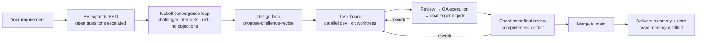
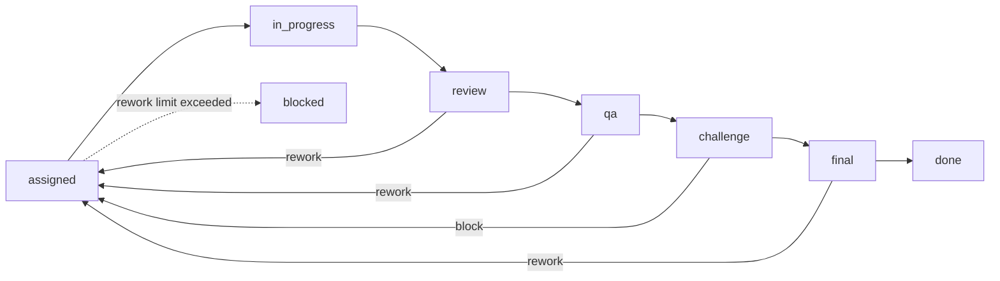

**English** | [中文](README.md)

# Agent Team · Multi-Agent Collaborative Dev Platform

A locally-run multi-agent development app: up to **10 AI agents** work like a real software team — **clarifying requirements, holding meetings (interruptible by a live challenger), splitting tasks, writing code in isolated git worktrees, reviewing each other, verifying by real execution, nitpicking before merge, and distilling team memory**. Only the decisions that matter get escalated to you for approval; the team reports progress on a schedule (every 2 hours by default) with desktop notifications.

Built on the [Claude Agent SDK](https://www.npmjs.com/package/@anthropic-ai/claude-agent-sdk): every agent is a headless Claude Code session with real file I/O and command execution. The deliverable is running code, not a chat transcript.



## Features at a Glance

- **10 configurable roles**, enable on demand — a disabled role costs zero (no session created)
- **Challenger mechanism**: anyone speaking in a meeting may be interrupted and challenged on the spot; the meeting only continues once the answer satisfies the challenger. Design docs, pre-merge diffs, and approval decisions all pass through it too
- **Real dev loop**: every task is developed on its own git worktree branch; diff review → black-box QA execution → nitpick → merge to main; rejections automatically carry feedback back into rework
- **Task dependency DAG**: task splitting declares inter-task dependencies and file ownership; scheduling gates on dependencies — test tasks wait for the implementation to merge and use its artifacts, eliminating "everyone writes their own copy" rework at the root (measured: 5 rework rounds → 0 on a comparable project)
- **Concurrent projects**: multiple projects run unattended at the same time (default cap 2, adjustable 1-4; over-cap starts queue automatically) — each project gets its own session pool / meetings / task flow / cost ledger, fully isolated; switch views from the dashboard
- **Talk to the team anytime**: type in the meeting-room team channel and the coordinator answers immediately with live status; change requests become priority tasks that jump the queue (works on any project, not just the one you're viewing)
- **Selectable approval policy**: default is "budget-only" — dangerous commands auto-pass with an audit trail, tech choices auto-accept the team recommendation, rework-limit hits get one automatic extra round; only money questions interrupt you. Switch to "everything needs a human" anytime
- **Workspace visualization**: file tree + code/markdown viewer, per-task diff tracing, sandboxed in-app preview of web artifacts, one-click zip download
- **Team memory**: rework feedback, challenger exchanges, rulings, and your approval comments are auto-archived; the scribe distills them into reusable lessons injected into future task briefs — agents don't get "amnesia" after session recycling
- **Cost control**: tiered models + per-role effort + session recycling + batched challenger checks + budget circuit breaker; every call's tokens/cost is recorded and visible live
- **Mixed model vendors**: connect DeepSeek / GLM / Kimi and other Anthropic-compatible endpoints, mixing vendors per role; balance display + one-click top-up
- **Custom skills / MCP tools**: inject domain knowledge/conventions into role system prompts (skills); connect external MCP servers (filesystem, GitHub, databases, web scraping, …) to extend agent toolsets per role
- **Fully bilingual**: UI language and the team's working language are independently switchable between 中文 / English

## Quick Start

One command (checks the environment → installs dependencies → starts both ends → opens the browser):

```powershell
.\setup.ps1          # Windows
```

```bash
./setup.sh           # macOS / Linux
```

The script requires Node.js ≥ 20 and git (hard), and detects model credentials (a logged-in Claude Code / `ANTHROPIC_API_KEY` / a third-party endpoint — any one of the three; missing ones only warn, never block). The manual way still works:

```bash
npm install
npm run start        # starts server (3100) and web (5174); use npm run dev for hot-reload development
```

Open http://localhost:5174, enter a project requirement on the dashboard, set a budget, click "Start project", and watch the team get to work. All you handle are the decisions escalated to the approval center.

## The Ten Roles

| Role | Responsibility | Default model | effort | Default |
|---|---|---|---|---|
| Coordinator | Chairs meetings, splits & assigns tasks, breaks deadlocks, periodic reports | opus | medium | always on |
| Business Analyst (ba) | Expands requirements into a PRD (testable acceptance criteria), escalates open questions to you | opus | high | on |
| Architect | Tech choices, DESIGN.md, answers questions during development | opus | high | on |
| Frontend | Frontend tasks | sonnet | high | always on |
| Backend | Backend tasks | sonnet | high | always on |
| DevOps | Environment / dependency / build-script / CI tasks | sonnet | medium | **off** |
| Reviewer | Reviews diffs, comments or rejects | sonnet | medium | on |
| QA | Black-box testing against acceptance criteria | sonnet | medium | on |
| Challenger | Meeting interrupts, design challenges, pre-merge nitpicks, approval counsel | sonnet | medium | on |
| Scribe | Task / project retros, distills team memory | haiku | low | on |

Model, effort, and on/off are individually adjustable per role on the Settings page. Coordinator / frontend / backend are permanent roles and cannot be disabled.

## How It Works

### 1. Requirement Analysis (BA)

You type a one-line requirement; the BA expands it into a PRD: feature list, non-goals, **individually testable acceptance criteria**, and open questions. Open questions are escalated to you as approvals for clarification (up to 2 rounds); answers are written back into the PRD, saved to `repo/PRD.md`, and committed to git. Vague requirements are the #1 source of rework — this step treats the root cause.

### 2. Kickoff Meeting: Requirement Convergence Loop (challenger may interrupt)

Enabled roles speak in turn; each participant only receives the incremental transcript since their last turn, keeping context from exploding. The meeting produces a task list, which the coordinator splits and assigns.

**The challenger doesn't wait for its turn** — it listens in: after every coordinator statement and at the end of every participant round it runs a check. The standard: "if not raising this now means fixing it later costs more, interrupt." When it interrupts:

```
Challenge (naming a specific person) → the challenged responds → challenger judges
  ├─ satisfied   → meeting continues
  ├─ unsatisfied → follow-up (max 2 rounds by default)
  └─ still stuck → coordinator rules on the spot; the ruling is archived as team memory
```

At most 6 interrupts per meeting, so the meeting can always finish.

**The convergence loop**: after each discussion round the challenger issues a convergence verdict — **no objections means the meeting ends early**; otherwise objections are pasted into the minutes and the next round's participants must address them specifically. The round cap (default 4) is only an anti-infinite-loop backstop; an all-PASS round counts as deadlock and stops, with remaining objections forced into the coordinator's closing for item-by-item rulings (adopt into tasks, or state why not).

### 3. Architecture Design Loop (propose-challenge-revise)

The architect writes `DESIGN.md` (module split, file ownership, interface contracts), then enters the design loop: **challenger reviews → architect revises → challenger re-reviews the revision**, looping until the challenger passes it or the cap is hit (default 3 cycles). If the cap is hit without convergence it proceeds with a warning — unresolved concerns are archived into team memory and inherited as reminders in the engineers' dev briefs.

### 4. The Development Loop

Every task is developed on its own git worktree branch (`wt-task-<id>`), fully isolated. The task state machine:



- **Self-test gate**: after the dev commits, the system **actually executes** the project's self-test command in the task worktree (the `test_cmd` declared by the coordinator at kickoff); failure skips review entirely and goes straight back to rework — "doesn't even run" code is stopped before it wastes a whole review/QA round-trip
- **The reviewer** sees only the diff (lockfiles and other noise excluded), comments or rejects
- **QA** actually runs the code in the worktree, testing against the PRD's acceptance criteria
- **The challenger** nitpicks before merge: severe issues block into rework, minor ones pass with a record
- **Coordinator final review**: after all quality gates and before merge, the coordinator issues a completeness verdict against the acceptance criteria and PRD (judging only what's missing/off-target, not re-reviewing code); failure sends the task back to the original developer
- **Integration regression gate**: after a task merges into main, the system runs the full-project `test_cmd` once more in the main repo — "a later merge breaking an earlier accepted task" gets caught on the spot: failures automatically reopen the task (fresh worktree based on current main) to fix the regression; only two consecutive failures block and escalate
- Rejections automatically carry feedback into rework; exceeding the consecutive-rejection cap (default 3) escalates to you for a ruling
- **Merge conflicts**: the first conflict automatically reworks with instructions (rebase main and resubmit); only the second blocks and waits for you. Blocked tasks have a one-click retry on the board

### 5. Delivery & Retrospective

Once all tasks are merged, the coordinator publishes a delivery summary; the scribe runs retros on reworked tasks and the whole project, distilling reusable lessons (team memory).

## Team Memory

Solves two real pains: agents "forgetting" after session recycling / compaction, and the same trap being stepped in repeatedly.

- **Auto-archive (zero LLM cost)**: review rejection feedback, challenger block reasons, coordinator rulings, and your approval comments are stored as they happen
- **Scribe distillation (low-frequency, haiku)**: retros only run on tasks that had rework (1-3 lessons) plus one global retro at project end — it is not an always-on minute-taker; meeting transcripts are already in the database
- **Auto-injection**: keyword matching (Chinese & English) attaches relevant lessons to future task briefs and kickoff openings; an agent rebuilt after session recycling gets a memory digest in its first brief
- **"Team Memory" page**: search / add manually (your own hard-won lessons welcome, pinned by default) / pin / delete

## Talk to the Team Anytime (Team Channel)

The "team channel" in the meeting room has an input box that always works:

- **Ask for status**: the coordinator answers from a live state snapshot (tasks/spend/budget) — no making things up
- **Request changes**: highest priority — the coordinator immediately materializes it via `create_task(priority=1)` to jump the queue, and can declare dependencies on existing tasks; works even after project completion (click "Resume" to execute)
- Conversations survive server restarts (the coordinator session lazily restarts and restores context)

## Approval Center

The **approval policy** (Settings) defaults to "budget-only": only budget/balance items pop a dialog — dangerous commands auto-pass with an event trail, tech-choice approvals auto-accept the team recommendation (recorded as decided in the approval center), rework-limit hits automatically get one final round before blocking, and BA open questions proceed on reasonable assumptions announced in the channel. Switch to "escalate everything" and the following all pause the flow for your decision:

| Trigger | Description |
|---|---|
| Major tech choice / requirement change | Escalated by the coordinator or architect |
| BA requirement clarification | PRD open questions confirmed with you in batches |
| Dangerous command | `rm -rf`, `git push`, network downloads, etc., intercepted by the Bash policy allowlist |
| Installing new dependencies | `npm install` etc. (with the challenger's counsel attached: do we actually need this?) |
| Budget overrun | Circuit breaker pauses; requests a top-up or wrap-up |
| Consecutive rejection limit | Task rework exceeded the cap; you decide: another chance / force pass / abandon |

Tech-choice / dependency approvals automatically include the **challenger's counsel** (delivered within 3 minutes, never blocking). Agents are not falsely timed out while waiting on approvals. Your comments are archived into team memory.

## Cost Control

- **Tiered models**: high-value low-frequency roles (coordinator/architect/BA) on opus, workhorses on sonnet, distillation on haiku — see the role table, freely adjustable
- **Per-role effort**: controls the thinking budget — high for dev roles, medium for checking roles, low for distillation
- **Session recycling**: recycle involved agent sessions after task completion so long-lived history doesn't grow unbounded (late-project calls get expensive); team memory backstops the context
- **Batched challenger checks**: per-round instead of per-speaker — roughly 7 checks per meeting down to ~4
- **Empty-report skipping**: no report is generated when nothing changed; no burning money overnight
- **Budget circuit breaker**: per-project budget cap; exceeding it pauses and requests approval
- Every call's tokens/cost is recorded; the dashboard shows totals and per-role breakdowns live

**Measured reference (honest numbers)**: with tiered models a single dev round is about $1.1 (all-opus: $2.5-4). A small 5-task CLI project measured $35 end-to-end (including 2 merge-conflict reworks and several challenger exchanges; the all-opus baseline for the same complexity was $57). A task that passes in one go costs about $3-5 across the full chain (dev→review→QA→nitpick→final). **Rework is the dominant cost** — which is exactly why the BA, the challenger, and team memory exist. Latest benchmark: a small-to-mid feature (4 tasks, with convergence loop / design loop / all quality gates) on production defaults: **$37.93 / 44 minutes / 1 intervention** — full data in [docs/DOGFOOD-timeline-v1.md](docs/DOGFOOD-timeline-v1.md) (Chinese).

> When using Claude Code subscription credentials, the cost figures are API-equivalent pricing; actual consumption draws on your subscription quota. Hitting a subscription session limit auto-pauses the project (tasks stay in place); click "Resume" once the quota recovers.

## Speed

Every agent is a long-lived headless Claude Code subprocess (streaming input + AsyncQueue), hot for its whole lifetime. Two sources of pure wall-clock waste have been optimized away — **no meeting/review/QA/challenge step is cut**:

- **Event-driven scheduling**: the task scheduler went from fixed-interval polling to wakeable waits — the moment a phase finishes, the next one starts; no more idling out a tick. Phase transitions are back-to-back, saving tens of seconds of dead waiting on a multi-task project.
- **Keeping sessions hot** (`session_recycle`, see Settings): default `project_end` — sessions stay hot for the whole project (subprocess, prompt cache, and context preserved) and are only recycled when the project ends/pauses. Compared to per-task recycling this avoids cold-rebuilding reviewer/qa/dev after every task (respawn + resend full system prompt + lose cache); fewer cold starts actually **saves tokens** (cache reads replace full resends). The three settings:

  | Value | Behavior | Best for |
  |---|---|---|
  | `project_end` (default) | Recycle only at project end | Small/mid projects — fastest, hottest cache |
  | `on` | Recycle after every task | Very long projects — caps per-session context growth |
  | `off` | Never recycle | Debugging |

- **Per-role concurrency** (`concurrency.<role>`): a single reviewer/QA is the bottleneck of parallel development — they default to ×2 replica sessions (lazily created, recycled with the recycling policy) so multiple tasks' reviews/tests run in parallel; dev roles default to ×1 and can be raised for parallel development (worktrees isolate naturally). The coordinator is pinned at ×1 (meetings/chat/final review need continuous context).
- **Size-based recycling** (`context_recycle_tokens`, default 120k): the backstop for the keep-hot strategy — a session whose per-turn context exceeds the threshold is recycled and rebuilt between tasks, preventing unbounded per-turn cost growth on long projects (team memory backstops the context).

**Manual speed levers** (trade output depth/rigor; defaults untouched, adjust in Settings as needed): lower `effort.*` (architect/ba/dev default to high — thinking is the slowest part), reduce `meeting_max_rounds`, move low-value roles to faster model tiers.

## Connecting Third-Party Models (DeepSeek / GLM / Kimi …)

Any model exposing an **Anthropic-compatible `/v1/messages` endpoint** can be connected, and **mixed per role** — e.g. keep the coordinator on opus while the backend runs deepseek-v4-flash. The "Model Providers" card on the Settings page adds presets in one click (DeepSeek / Zhipu GLM / Kimi ship with endpoints and price tables built in); paste your API key, then pick the model in the role's model dropdown.

| Provider | Endpoint | Balance query | Notes |
|---|---|---|---|
| DeepSeek | `https://api.deepseek.com/anthropic` | ✓ (auto-display + top-up link) | battle-tested |
| Zhipu GLM | `https://open.bigmodel.cn/api/anthropic` | no public API (top-up link provided) | battle-tested |
| Kimi (Moonshot) | `https://api.moonshot.cn/anthropic` | ✓ | preset untested |
| **OpenAI (GPT family)** | `http://127.0.0.1:4000` (local LiteLLM proxy) | — | see setup below |
| Others / self-hosted proxy | custom provider with your endpoint | optional | Gemini etc. likewise via LiteLLM |

### OpenAI (GPT family) via a local LiteLLM proxy

OpenAI has no Anthropic-compatible endpoint, and agent subprocesses only speak the Anthropic Messages protocol — so [LiteLLM](https://docs.litellm.ai/) sits in between as a protocol translator (it natively supports the unified `/v1/messages` endpoint):

1. Install the proxy (requires Python): `pip install "litellm[proxy]"`
2. Write `litellm-config.yaml`:

```yaml
model_list:
  - model_name: gpt-5.1
    litellm_params: { model: openai/gpt-5.1, api_key: os.environ/OPENAI_API_KEY }
  - model_name: gpt-5-mini
    litellm_params: { model: openai/gpt-5-mini, api_key: os.environ/OPENAI_API_KEY }
  - model_name: gpt-4.1-mini
    litellm_params: { model: openai/gpt-4.1-mini, api_key: os.environ/OPENAI_API_KEY }
general_settings:
  master_key: sk-litellm-pick-a-local-password
```

3. On Settings → "Model Providers", one-click add the "OpenAI (via LiteLLM proxy)" preset. **Use LiteLLM's master_key as the API key** (the real OpenAI key lives only on the LiteLLM side, never in this platform), then pick `openai/gpt-5-mini` etc. in the role model dropdowns.

**The proxy is platform-managed — no manual start needed**: whenever an enabled role's model points at a loopback provider, the platform auto-spawns `litellm --config litellm-config.yaml --port 4000` at project start (config path adjustable via the `litellm_config` setting), health-polls it, and shuts it down with the server. Spawn failures (litellm not installed / config missing) raise a visible warning in the team channel, and the provider card has a status row with a "Check / Start" button. An external LiteLLM process you started yourself is detected and reused (not double-spawned, not killed on shutdown). Put `OPENAI_API_KEY` in your system environment variables so the managed process inherits it.

Notes: effort/thinking is not passed through (presets disable it); OpenAI does automatic prompt caching (≥1024 tokens) — cache prices follow its cache discount; **GPT-family models were not trained for this harness's tool flows — trial them on review/QA roles with a small project first**, and keep the coordinator on a strong official model.

Implementation details worth knowing:

- Each agent session gets its **own injected** `ANTHROPIC_BASE_URL` / `ANTHROPIC_AUTH_TOKEN` per role config (isolated; official-model roles keep using your local Claude Code login credentials); `ANTHROPIC_SMALL_FAST_MODEL` maps Claude Code's internal helper calls to a small model on the endpoint side
- **Billing**: third-party endpoints' self-reported costs are unreliable — the platform does local accounting from your configured price table (USD per million tokens); the budget circuit breaker works as usual; per-model cost queries via `byModel` in `/api/usage`
- **Balances**: the Settings page shows account balances (server-side query, keys never sent to the browser), with a "Top up" deep link
- **Security**: API keys live only in the local `data/meeting.db` (gitignored); every API response is masked (presence + last 4 chars only); keys never enter logs/events/WS
- **Strongly recommended: keep the coordinator on a strong official model** — it does task splitting and other JSON rulings, and parse failures fail the whole project; before moving JSON-protocol roles (challenger/reviewer/QA) to a third party, trial on a small project first (Settings shows a warning)
- Insufficient balance / rate limiting is recognized as recoverable: the project auto-pauses, resume after topping up; a misconfigured key blocks tasks visibly instead of waiting forever

## Custom Skills / MCP Tools (extending agents)

Two per-role extension mechanisms, both managed under Settings; **changes take effect the next time the affected agent's session starts** (new project, or rebuild after session recycling):

- **Skills** ("Skills" page): write domain knowledge, coding conventions, glossaries, or procedures as text injected into selected roles' **system prompts**. Best for "constraints/knowledge".
- **MCP tools** ("MCP Tools" page): connect external [MCP](https://modelcontextprotocol.io) servers to **extend the toolset** per role (filesystem, GitHub, databases, web scraping, …), injected into agent sessions alongside the built-in collaboration tools. Best for "new capabilities".

Three transports:

| Transport | Scenario | Fields |
|---|---|---|
| `stdio` | local process | `command` + `args` (one per line) + `env` (may contain secrets) |
| `sse` / `http` | remote endpoint | `url` + `headers` (may contain secrets) |

### Browser-capable QA (Playwright preset)

"Can't test interactions" used to be QA's blind spot on web projects — the "MCP Tools" page now ships a **built-in Playwright preset** (Microsoft's official [@playwright/mcp](https://github.com/microsoft/playwright-mcp)): one click gives the QA role a real browser — open pages, click, fill forms, assert visible content. The QA prompt now instructs it to actually open web deliverables instead of inferring from code.

One-time prerequisites:

```bash
npx playwright install chromium        # download the browser (~130MB)
npx -y @playwright/mcp@latest --version  # optional: warm the npx cache so the first session starts fast
```

The preset defaults to `--headless --isolated` (headless + clean in-memory profile per session) and is injected only into the QA role; edit to change.

Key points:

- **Naming**: letters/digits/`-`/`_` only, max 32 chars; used as the tool prefix `mcp__<name>__`, must be unique (`collab` is a reserved built-in name)
- **Per-role injection**: no roles selected = everyone; otherwise only selected roles' sessions get it
- **Non-blocking startup**: MCP servers connect in the background; an unreachable server doesn't stop session creation — tools appear once connected (protects session startup speed)
- **Security**: `env` / `headers` values live only in the local `data/meeting.db` (gitignored); all API output is masked to `••••••`; they never enter `/api/state`/logs/events/WS. When editing, leaving the mask untouched keeps the original secret — only changed keys are written. **Never uploaded to GitHub**

## Frontend Pages

| Page | Contents |
|---|---|
| Dashboard | Project status, live cost stats (total + per-role), event stream, start/pause/resume |
| Meeting Room | Live streaming agent discussion, challenger interrupts as they happen; "team channel" shows DMs and system messages + **the always-on chat box** |
| Task Board | Backlog → In dev → In review → In QA → Challenging → Done / Blocked; dependency badges, user-priority ★, one-click retry for blocked tasks (downstream dependents auto-reset) |
| Workspace | Per-project deliverables: file tree (PRD/DESIGN pinned), code/markdown viewer, per-task diff (merged tasks traced from the merge commit), sandboxed iframe preview of web artifacts, zip download |
| Approvals | Pending decisions + challenger counsel + history |
| Reports | Periodic report timeline (with desktop notifications) |
| Team Memory | Lesson search / manual add / pin / delete |
| Skills | Per-role system-prompt knowledge injection; CRUD + enable toggle |
| MCP Tools | Per-role external MCP servers (stdio / sse / http); CRUD + enable toggle, secrets masked |
| Metrics | Wall clock / cost / first-pass rate / interventions, per-gate interception table, phase timeline swimlane |
| Settings | UI language, team working language, role toggles, per-role model + effort, the challenger's four hooks, report schedule, budget, … |

## Settings

| Key | Default | Description |
|---|---|---|
| `team_language` | `zh` | Team working language (role prompts and all orchestration text), `zh` / `en`; takes effect after session restart |
| `approval_policy` | `budget_only` | Budget-only human approval (everything else auto-handled with audit trail) / `all` escalate everything |
| `model.<role>` / `effort.<role>` | see role table | Per-role model and thinking budget |
| `role_enabled.<role>` | see role table | Role toggle; off = zero cost |
| `challenge_meeting / design / tasks / approvals` | `on` | Independent toggles for the challenger's four hooks |
| `challenge_max_followups` | `2` | Max follow-up rounds per challenge; deadlock goes to the coordinator |
| `meeting_max_rounds` | `4` | Meeting round backstop (convergence verdict ends the meeting early when no objections) |
| `design_max_cycles` | `3` | Design-loop challenge-revise cap (challenger pass exits early) |
| `final_review` | `on` | Coordinator final review: completeness verdict against acceptance criteria before merge |
| `selftest_gate` | `on` | Self-test gate: actually run the project `test_cmd` after dev commits; failure reworks immediately |
| `integration_gate` | `on` | Integration regression gate: run the full-project `test_cmd` in the main repo after each merge; failure reopens the task |
| `concurrency.<role>` | reviewer/qa `2`, others `1` | Per-role task-phase concurrency (1-4, replica sessions) |
| `max_concurrent_projects` | `2` | Cap on simultaneously running project flows (1-4); over-cap starts auto-pause and wait |
| `auth_token` | empty | When set, all API/WS calls require the Bearer token (required before LAN sharing); empty = local-only, zero friction |
| `cors_origins` | empty | Extra CORS allowlist (comma-separated full Origins); loopback is always allowed |
| `context_recycle_tokens` | `120000` | Size-based recycle threshold; a session whose per-turn context exceeds it is rebuilt between tasks; `0` disables |
| `max_review_cycles` | `3` | Consecutive rejection cap; exceeding escalates to you |
| `session_recycle` | `project_end` | When to recycle sessions: `project_end` (default — fastest, hottest cache) / `on` per-task / `off` never |
| `budget_usd` | `10` | Project budget cap (USD); circuit-breaks on overrun |
| `report_cron` | `0 */2 * * *` | Report schedule cron; `report_test_mode=fast` switches to every 2 minutes for verification |

## REST API

The frontend uses exactly these endpoints; scripts can call them directly:

```
GET  /api/state                        full state snapshot
POST /api/projects                     {name, requirement, budget_usd} create & start
POST /api/projects/:id/pause|resume    pause / resume
GET  /api/tasks                        task list
POST /api/tasks/:id/retry              retry a blocked task (optional note)
GET  /api/approvals[/pending]          approvals
POST /api/approvals/:id/decision       {approve, decision?, comment?}
GET  /api/reports · POST /api/reports/generate
GET  /api/usage                        cost stats (?project_id= to scope)
GET  /api/metrics/:id                  per-project metrics (first-pass rate / gates / interventions / phases)
GET/PUT /api/settings
GET  /api/events?limit=100             event stream
GET/POST /api/lessons · POST /api/lessons/:id/pin · DELETE /api/lessons/:id
GET  /api/meetings/:id/messages · GET /api/messages/direct
GET  /api/providers                    providers (keys masked)
GET  /api/providers/presets            built-in presets (DeepSeek/GLM/Kimi/OpenAI)
POST /api/providers · PUT/DELETE /api/providers/:id
GET  /api/providers/:id/balance        balance proxy query (60s cache)
GET  /api/proxy/status · POST /api/proxy/ensure   managed LiteLLM sidecar
GET/POST /api/skills · PUT/DELETE /api/skills/:id          custom skills
GET/POST /api/mcp-servers · PUT/DELETE /api/mcp-servers/:id  MCP servers (env/headers masked)
POST /api/chat                         user chat (coordinator replies; change requests become priority tasks)
GET  /api/projects                     all projects (workspace switcher)
GET  /api/workspace/:pid/tree|file|archive.zip|preview/*
GET  /api/workspace/:pid/tasks/:tid/diff
```

State changes are pushed live over WebSocket; the frontend subscribes automatically.

## Directory Layout

```
server/                Fastify backend + orchestration engine
  src/orchestrator/    engine (entry) / agentPool (session pool & permission gate)
                       meetingRunner (meetings & challenger interrupts) / taskFlow (task state machine)
                       approvalGate / reporter (periodic reports)
                       memory (team memory) / policies (Bash allowlist) / texts (bilingual copy)
  src/db/              SQLite schema & DAO
  prompts/{zh,en}/     system prompts for the ten roles (follows team working language)
  test/                unit tests (vitest)
web/                   Vite + React frontend (tiny homegrown i18n, zero extra deps)
data/                  SQLite database (runtime, gitignored)
workspaces/            per-project git workspaces (runtime, gitignored)
```

**Where deliverables live**: each project's code is in `workspaces/project-<id>/repo` (an independent git repository whose main branch is the deliverable); task development happens in `wt-task-<id>` worktrees alongside it.

## Common Commands

```bash
npm run dev            # start both (server:3100, web:5174)
npm run dev:server     # backend only
npm run dev:web        # frontend only
npm run test           # unit tests (vitest)
npm run typecheck      # typecheck both ends
```

## Security & Caveats

- Agent file writes are confined to their project workspaces; Bash commands pass an allowlist policy — `rm -rf`, `git push`, network commands, dependency installs, etc. are diverted to approval; **user-configured MCP write tools obey the same workspace boundary** (absolute paths / file:// URLs outside the workspace are hard-denied, no approval path)
- **Set an access token before LAN sharing** (Settings → Security): once set, every API and WebSocket call requires the Bearer token, and the browser shows an unlock prompt on first visit; CORS only allows loopback by default — add cross-device Origins to the allowlist. The default (empty token) listens on 127.0.0.1 only, zero friction locally
- After a server restart, running projects switch to "paused"; click "Resume" on the dashboard to recover (agents restore context by session; team memory backstops what can't be restored)
- The database (`data/`) and project workspaces (`workspaces/`) are gitignored; runtime data never enters this repository
- This repository contains no API keys; credentials come from your locally logged-in Claude Code or environment variables

## Roadmap

**North star**: turn development work that isn't worth watching into work you can hand over overnight — the product sells **autonomy and trustworthiness**, not "faster and cheaper".
**North-star metrics**: unattended completion rate + interventions per project (approvals + chat interventions).

### v0.2 "Prove it" — evidence before features

| # | Item | Success criteria |
|---|---|---|
| 1 | ✅ **Dogfood a mid-size feature**: the platform builds its own "phase timeline view", fully unattended | **Done** (2026-07-13, project #9): 44 min / $37.93 / 1 intervention (budget confirmation) / 60 tests green — full data in [docs/DOGFOOD-timeline-v1.md](docs/DOGFOOD-timeline-v1.md) (Chinese) |
| 2 | ✅ **Metrics page**: first-pass rate, per-gate interception (how much review/QA/challenge/final each catch), cost per task, interventions | **Done**: "Metrics" page — four stat cards + five-gate interception table + phase timeline swimlane (kernel ported from the dogfood deliverable); validated line-by-line against project #9's hand-written report |
| 3 | ✅ Persist final-review verdicts (QA/challenge summaries to DB, survive restarts) | **Done**: `tasks.verdicts` column; the coordinator's final-review brief reads from the DB — a restart no longer degrades it to "(record unavailable)" |

### v0.3 "Throughput" — from one delegated project to three

| # | Item | Notes |
|---|---|---|
| 4 | ✅ **Concurrent projects**: per-project pool/engine | **Done** (2026-07-17, dual-project E2E): two CLI projects ran unattended simultaneously — 9.7 / 8.0 min wall clocks fully overlapping, $0.04 each (deepseek-v4-flash), both 2/2 first-pass, zero interventions; sessions/costs/deliverables fully isolated per project; a third project hit the cap and queued automatically |
| 5 | ✅ **Browser-capable QA**: Playwright MCP preset + docs | **Done**: built-in preset on the "MCP Tools" page with one-click add (Microsoft's official @playwright/mcp, headless+isolated, QA-only by default); QA prompt now requires actually opening web deliverables; local smoke passed (v0.0.78, flag validation + full UI round trip) |
| 6 | ✅ **Integration regression gate**: run the full-project test_cmd after each merge to main | **Done**: failures automatically reopen the task to fix the regression (fresh worktree based on the now-broken main); only two consecutive failures block and escalate; "Integration" added to the metrics gate table; covered by state-machine tests with real git + real execution on both paths |

### v0.4 "Onboarding" — get a second user running

| # | Item | Notes |
|---|---|---|
| 7 | ✅ One-click install/start script (`setup.ps1` / `setup.sh`) + real second-user onboarding | **Script delivered**: environment checks → install → start → open browser; fresh-clone E2E from zero to all-healthy (fixing two real onboarding blockers along the way: PS5.1 BOM-less non-ASCII scripts, tsx watch hanging without a TTY); **a real second-user test is still pending** |
| 8 | `/api/state` pagination + WS incremental updates | Full refetches get slow as project history grows |
| 9 | ✅ MCP write-tool boundary checks + minimal token auth + CORS tightening | **Done**: MCP write tools share the built-in Write boundary (absolute paths / file:// outside the workspace hard-denied); with `auth_token` set every API/WS call requires Bearer (frontend unlock overlay; E2E verified all six semantics: 401/101/CORS); CORS defaults to a loopback allowlist |

### Long-term directions & principles

- **Scheduler evolution**: event-sourcing direction kept on the shelf (current event-driven scheduling + crash sweeping absorbed most of the pain; no rush)
- **Contract-file subscriptions**: PRD/DESIGN.md changes notify affected agents
- **Hybrid session forms**: pure-JSON verdict steps (nitpick/final/convergence) could move to lightweight direct API calls, saving subprocess overhead
- Principles: Agent SDK version pinned, E2E regression before upgrades; every new feature gets dogfooded on the platform itself first; **explicitly not doing** multi-user accounts or cloud hosting (out of scope)

## Tech Stack

Full-stack TypeScript: Fastify + WebSocket + better-sqlite3 (backend), React + Vite (frontend), @anthropic-ai/claude-agent-sdk (agent engine — note it requires zod v4), node-cron + node-notifier (reports & desktop notifications).
