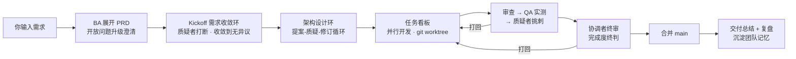
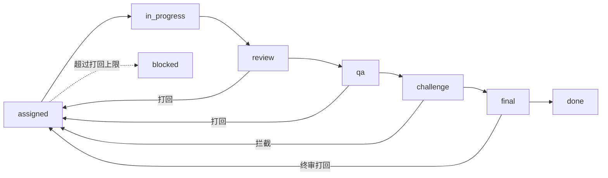

# Agent Team · 多智能体协作开发平台

一个本地运行的多 Agent 协作开发应用：最多 **10 个 AI agent** 像真实软件团队一样工作——**澄清需求、开会讨论（可被当场质疑打断）、拆分任务、在独立 git 工作区写代码、互相审查、实测验收、合并前挑刺、沉淀团队记忆**。最重要的决策升级给你审批；按周期（默认每 2 小时）向你汇报进度并弹桌面通知。

基于 [Claude Agent SDK](https://www.npmjs.com/package/@anthropic-ai/claude-agent-sdk)：每个 agent 是一个 headless Claude Code 会话，具备真实的文件读写 / 命令执行能力，产出是能跑的代码，不是聊天记录。



## 特性一览

- **10 个可配置角色**，按需启用，关闭即零成本（不建会话）
- **质疑者机制**：会议中任何人发言后都可能被当场打断质疑，回答让它满意会议才继续；设计文档、合并前、审批决策它都要过一遍
- **真实开发闭环**：每个任务在独立 git worktree 分支开发，审查 diff → QA 黑盒实测 → 挑刺 → 合并 main；打回自动带意见返工
- **任务依赖 DAG**：拆分时声明任务间依赖与文件所有权，调度按依赖门控——测试任务等实现合并后才开工、直接用产物，从根上消灭"各写一份副本"式返工（实测同结构项目返工从 5 轮降到 0）
- **随时对话**：会议室团队频道里直接跟团队说话，协调者即时回答进度与问题；修改要求立刻落成优先任务插队处理
- **审批策略可选**：默认「仅预算需人批」——危险命令自动放行留痕、选型按团队推荐自动通过、打回超限自动多给一轮，只有花钱的事来找你；也可切回全部人批
- **工作区可视化**：文件树 + 代码/markdown 查看、每任务 diff 追溯、网页产物平台内沙箱预览、一键下载 zip
- **团队记忆**：返工意见、质疑交锋、裁决、你的审批批示自动归档；书记官低频提炼成可复用教训，自动注入后续任务简报——会话回收后 agent 不"失忆"
- **成本可控**：分级模型 + 按角色 effort + 会话回收 + 批量旁听 + 预算熔断，每次调用的 token/费用入库实时可见
- **多模型混配**：接入 DeepSeek / GLM / Kimi 等 Anthropic 兼容端点，按角色混用不同厂商模型；余额直显 + 一键充值
- **自定义技能 / MCP 工具**：把领域知识/规范注入角色系统提示词（技能）；接入外部 MCP 服务器（文件系统、GitHub、数据库、网页抓取等）按角色扩展 agent 工具集
- **全双语**：界面与 agent 工作语言均支持中文 / English，可分别设置

## 快速开始

前置条件：Node.js ≥ 20、git、已登录的 Claude Code（或设置 `ANTHROPIC_API_KEY` 环境变量）。

```bash
npm install
npm run dev          # 同时启动 server(3100) 和 web(5174)
```

打开 http://localhost:5174，在仪表盘输入项目需求、设置预算，点「启动项目」，然后看团队开工。你只需要处理审批中心里升级给你的决策。

## 十个角色

| 角色 | 职责 | 默认模型 | effort | 默认状态 |
|---|---|---|---|---|
| 协调者 coordinator | 主持会议、拆分分派任务、僵局裁决、周期汇报 | opus | medium | 常驻 |
| 需求分析师 ba | 需求展开成 PRD（逐条可测验收标准），开放问题向你澄清 | opus | high | 开 |
| 架构师 architect | 技术选型、DESIGN.md、开发中答疑 | opus | high | 开 |
| 前端 frontend | 前端任务开发 | sonnet | high | 常驻 |
| 后端 backend | 后端任务开发 | sonnet | high | 常驻 |
| DevOps devops | 环境 / 依赖 / 构建脚本 / CI 类任务 | sonnet | medium | **关** |
| 审查员 reviewer | 审 diff，提修改意见或打回 | sonnet | medium | 开 |
| QA qa | 按验收标准黑盒实测 | sonnet | medium | 开 |
| 质疑者 challenger | 会议打断、设计质疑、合并前挑刺、审批参谋 | sonnet | medium | 开 |
| 书记官 scribe | 任务 / 项目复盘，提炼团队记忆 | haiku | low | 开 |

模型、effort、开关都可在设置页按角色单独调整。协调者 / 前端 / 后端为常驻角色不可关闭。

## 它是怎么工作的

### 1. 需求分析（BA）

你输入一句话需求，BA 把它展开成 PRD：功能清单、非目标、**逐条可测的验收标准**、开放问题。开放问题会作为审批升级给你逐条澄清（最多 2 轮），澄清结果写回 PRD，落盘 `repo/PRD.md` 并提交 git。含糊需求是返工的最大根源，这一步是治本的。

### 2. Kickoff 会议：需求收敛环（质疑者可打断）

启用的角色轮流发言，每人只收到自己上次发言之后的增量记录，避免上下文爆炸。会议产出任务清单，由协调者拆分并分派。

**质疑者不按次序发言**——它旁听：协调者每次发言后、参会者每轮结束后，它都会做一次检查，判断标准是"如果现在不指出、会后修复的代价会更高，就应该打断"。一旦打断：

```
质疑（指名道姓） → 被质疑者回答 → 质疑者评判
  ├─ 满意 → 会议继续
  ├─ 不满意 → 追问（默认最多 2 轮）
  └─ 仍僵持 → 协调者当场裁决，裁决结果自动归档为团队记忆
```

每场会议最多打断 6 次，防止会开不下去。

**收敛环**：每轮讨论结束后质疑者做一次收敛裁决——**无异议即提前散会**；有异议则贴进会议记录，下一轮参会者必须针对性回应。轮数上限（默认 4）只做防死循环兜底；全员 PASS 视为死锁即止，剩余异议强制进协调者总结逐条裁决（采纳入任务或说明理由）。

### 3. 架构设计环（提案-质疑-修订循环）

架构师写 `DESIGN.md`（模块划分、文件所有权、接口约定），随后进入设计环：**质疑者审 → 架构师修订 → 质疑者复审修订版**，循环到质疑者放行或达上限（默认 3 轮）。达上限仍未收敛则告警放行——未解决的顾虑归档进团队记忆，工程师开发简报里会继承提醒。

### 4. 开发循环

每个任务在独立的 git worktree 分支（`wt-task-<id>`）开发，互不干扰。任务状态机：



- **自测门**：dev 提交后系统在其 worktree **真实执行**项目自测命令（kickoff 时协调者声明的 `test_cmd`），失败不进审查、直接打回——"跑都跑不起来"的代码被挡在整圈审查/QA 往返之前
- **审查员**只看 diff（已排除 lockfile 等噪音），提意见或打回
- **QA** 在 worktree 里真的跑起来测，对照 PRD 验收标准
- **质疑者**合并前挑刺：严重问题拦截返工，小问题放行并记录
- **协调者终审**：全部质检过后、合并前，协调者对照验收标准与 PRD 做完成度终判（只判漏做/做偏，不重复代码审查），不通过打回原开发者
- 打回自动携带意见返工；连续打回超过上限（默认 3 次）升级给你裁决
- **合并冲突**：第一次自动带说明打回返工（rebase main 后重提），第二次才标记阻塞等你处理；看板上阻塞的任务可以一键重试

### 5. 交付与复盘

全部任务合并后，协调者发布交付总结；书记官对有返工的任务和整个项目做复盘，提炼成可复用的教训（团队记忆）。

## 团队记忆

解决两个真实痛点：agent 会话回收 / compact 后"失忆"，以及同样的坑反复踩。

- **自动归档（零 LLM 成本）**：审查打回意见、质疑者拦截理由、协调者裁决、你的审批批示，产生时同步入库
- **书记官提炼（低频、haiku）**：任务有返工才复盘（1-3 条教训），项目结束做全局复盘——不是全程在线的会议记录员，会议原文本来就在库里
- **自动注入**：按关键词匹配（支持中英文），相关教训自动附在后续任务简报和 kickoff 开场里；会话回收后重建的 agent 第一份简报自动带记忆摘要
- **前端「团队记忆」页**：搜索 / 手动添加（你自己踩的坑也能写进去，默认置顶）/ 置顶 / 删除

## 随时对话（团队频道）

会议室「团队频道」底部有输入框，任何时候都能跟团队说话：

- **问进度**：协调者基于实时状态快照（任务/花费/预算）即时回答，不编造
- **提修改要求**：最高优先级——协调者立刻用 `create_task(priority=1)` 落成任务插队调度，能声明对既有任务的依赖；项目已完成也可以提（点「继续」即执行）
- 服务重启后对话不失效（协调者会话自动懒启动并恢复上下文）

## 审批中心

**审批策略**（设置页）默认「仅预算需人批」：只有预算/余额类会弹窗打扰你——危险命令自动放行并留事件痕迹、选型类按团队推荐自动通过（审批中心留已决记录）、打回超限自动多给最后一轮再阻塞、BA 开放问题按合理假设推进并发频道告知。切回「全部升级人批」后，以下情况都会暂停流程等你决定：

| 触发 | 说明 |
|---|---|
| 重大技术选型 / 需求变更 | 协调者或架构师主动升级 |
| BA 需求澄清 | PRD 开放问题逐批向你确认 |
| 危险命令 | `rm -rf`、`git push`、联网下载等，经 Bash 策略白名单拦截转审批 |
| 安装新依赖 | `npm install` 等（附质疑者的参考意见：是否真的需要这个依赖） |
| 预算超支 | 熔断暂停，请求追加或收尾 |
| 连续打回超限 | 任务返工超过上限，你来定：再给机会 / 强制通过 / 放弃 |

选型 / 依赖类审批会自动附上**质疑者的参谋意见**（3 分钟内给出，超时不阻塞）。审批等待期间 agent 不会被误判超时。你的批示会自动归档进团队记忆。

## 成本控制

- **分级模型**：高价值低频角色（协调者/架构师/BA）用 opus，工作马力用 sonnet，提炼用 haiku——见角色表，可自由调整
- **按角色 effort**：控制 thinking 预算，开发类 high，检查类 medium，提炼 low
- **会话回收**：任务终结后回收相关 agent 会话，防止长驻历史无限增长（后期单次调用会越来越贵）；团队记忆兜底上下文
- **质疑者批量旁听**：参会者按轮检查一次而非每人一次，一场会检查次数 ~7 → ~4
- **空报告跳过**：进度无变化时不生成报告，深夜不空转
- **预算熔断**：项目级预算上限，超出即暂停请求审批
- 每次调用的 token / 费用入库，仪表盘实时显示总额与分角色明细

**实测参考**（诚实数字）：分级模型后单次开发回合约 $1.1（全 opus 约 $2.5-4）。一个 5 任务的 CLI 小项目全链路实测 $35（含 2 次合并冲突返工和多轮质疑交锋；同复杂度全 opus 基线 $57）。一次通过的任务全链路（开发→审查→QA→挑刺）约 $3-5。**返工是成本大头**——这正是 BA、质疑者和团队记忆存在的理由。

> 使用 Claude Code 订阅凭据时，费用数字是等效 API 计价，实际消耗的是订阅额度。碰到订阅 session limit 时项目会自动暂停（任务留在原地），额度恢复后点「继续」即可续跑。

## 运行速度

每个 agent 是一个长驻的 headless Claude Code 子进程（流式输入 + AsyncQueue），存活期内是热的。影响墙钟时间的两处纯损耗已优化，**会议/审查/QA/质疑流程一个不砍**：

- **事件驱动调度**：任务调度循环从固定间隔轮询改为可唤醒等待——某阶段一完成即刻推进下一阶段，不再空等一个 tick。阶段切换基本背靠背，一个多任务项目累计省下几十秒死等。
- **会话保持热**（`session_recycle`，见设置项）：默认 `project_end`——项目进行期间会话全程热着（保住子进程、prompt 缓存与上下文），只在项目结束/暂停时回收。相比每任务回收，避免了 reviewer/qa/dev 在每个任务后被冷重建（重开子进程 + 全量重发系统提示词 + 丢缓存）；冷启减少反而**省 token**（cache read 代替全量重发）。三档权衡：

  | 值 | 行为 | 适用 |
  |---|---|---|
  | `project_end`（默认） | 项目结束才回收 | 中小项目，最快、缓存最热 |
  | `on` | 每任务终结即回收 | 超长项目，压单会话上下文增长 |
  | `off` | 从不回收 | 调试 |

- **角色并行度**（`concurrency.<role>`）：单 reviewer/QA 是并行开发的咽喉——默认 ×2 并发副本会话（懒建、随回收策略回收），多个任务的审查/测试并行走；开发角色默认 ×1，多任务并行开发可调高（worktree 天然隔离）。协调者恒 ×1（会议/对话/终审需上下文连续）。
- **按量回收**（`context_recycle_tokens`，默认 12 万）：保热策略的兜底——单轮上下文超阈值的会话在任务间隙自动回收重建，防长项目单轮成本无限上涨（团队记忆兜底上下文）。

**手动提速杠杆**（会牺牲产出深度/严谨，默认不动，按需在设置页调）：调低 `effort.*`（architect/ba/开发默认 high，thinking 最耗时）、减少 `meeting_max_rounds`、给低价值角色换更快的模型档。

## 接入第三方模型（DeepSeek / GLM / Kimi …）

任何提供 **Anthropic 兼容 `/v1/messages` 端点**的模型都能接入，并且**按角色混配**——比如协调者留 opus、后端换 deepseek-v4-flash。设置页「模型提供商」卡片从预设一键添加（DeepSeek / 智谱 GLM / Kimi 已内置端点与牌价），填上你的 API Key，然后在角色模型下拉里选对应模型即可。

| 提供商 | 端点 | 余额查询 | 备注 |
|---|---|---|---|
| DeepSeek | `https://api.deepseek.com/anthropic` | ✓（自动显示+一键充值） | 已实测 |
| 智谱 GLM | `https://open.bigmodel.cn/api/anthropic` | 无公开接口（提供充值链接） | 已实测 |
| Kimi (Moonshot) | `https://api.moonshot.cn/anthropic` | ✓ | 预设未实测 |
| **OpenAI（GPT 系）** | `http://127.0.0.1:4000`（本地 LiteLLM 代理） | 无 | 见下方配置步骤 |
| 其他 / 自建代理 | 自定义 provider 填端点即可 | 可选 | Gemini 等同理经 LiteLLM 转换 |

### 接 OpenAI（GPT 系）：经本地 LiteLLM 代理

OpenAI 没有 Anthropic 兼容端点，agent 子进程只讲 Anthropic Messages 协议——中间用 [LiteLLM](https://docs.litellm.ai/) 做协议翻译（它原生支持 `/v1/messages` 统一端点）：

1. 装代理（需 Python）：`pip install "litellm[proxy]"`
2. 写 `litellm-config.yaml`：

```yaml
model_list:
  - model_name: gpt-5.1
    litellm_params: { model: openai/gpt-5.1, api_key: os.environ/OPENAI_API_KEY }
  - model_name: gpt-5-mini
    litellm_params: { model: openai/gpt-5-mini, api_key: os.environ/OPENAI_API_KEY }
  - model_name: gpt-4.1-mini
    litellm_params: { model: openai/gpt-4.1-mini, api_key: os.environ/OPENAI_API_KEY }
general_settings:
  master_key: sk-litellm-自定义一个本地口令
```

3. 设置页「模型提供商」从预设一键添加「OpenAI（经 LiteLLM 代理）」，**API Key 填 LiteLLM 的 master_key**（OpenAI 真 key 只在 LiteLLM 侧，不进本平台），然后在角色模型下拉里选 `openai/gpt-5-mini` 等。

**代理由平台托管，无需手动启动**：只要有启用角色的模型指向本机回环 provider，项目启动时平台会自动拉起 `litellm --config litellm-config.yaml --port 4000`（配置路径可用设置项 `litellm_config` 改）、健康轮询、随服务关闭；拉起失败（未装 litellm / 缺配置）会在团队频道显性告警，设置页「模型提供商」卡也有状态行和「检查 / 拉起」按钮。你自己起的外部 LiteLLM 进程同样会被识别复用（不重复拉、关闭时也不动它）。`OPENAI_API_KEY` 建议写进系统环境变量供托管进程继承。

注意：effort/thinking 不透传（预设已关）；OpenAI 是自动 prompt 缓存（≥1024 tokens），cache 牌价按其缓存折扣配；**GPT 系模型未针对本 harness 的工具流训练，建议先给审查/QA 类角色小项目实测**，协调者保留官方强模型。

实现要点与注意：

- 每个 agent 会话按角色配置**独立注入** `ANTHROPIC_BASE_URL` / `ANTHROPIC_AUTH_TOKEN`（互不影响，官方角色继续走你本机的 Claude Code 登录凭据）；`ANTHROPIC_SMALL_FAST_MODEL` 把 Claude Code 内部辅助调用映射到端点侧小模型
- **计费**：第三方端点报的成本不可信，平台按你配置的价格表（美元/百万 tokens）本地记账，预算熔断照常工作；成本可按模型维度查询（`/api/usage` 的 `byModel`）
- **余额**：设置页显示各家账户余额（服务端代查，key 不下发浏览器），配「去充值」直达链接
- **安全**：API Key 只存本机 `data/meeting.db`（已 gitignore），前端接口一律脱敏（只回有无 + 后 4 位），不进日志/事件/WS
- **强烈建议协调者保留官方强模型**：它负责任务拆分等 JSON 裁决，解析失败会导致项目直接失败；质疑者/审查员/QA 等 JSON 协议角色换第三方前建议先小项目实测（设置页有对应警示）
- 欠费/限流会被识别为可恢复错误：项目自动暂停，充值后点「继续」续跑；key 配错则任务显性阻塞，不会无限等待

## 自定义技能 / MCP 工具（扩展 agent 能力）

两种按角色扩展 agent 的方式，都在设置区对应页面管理，**改动在相关 agent 下次会话启动时生效**（新项目或会话回收后重建）：

- **技能**（「技能」页）：把领域知识、编码规范、术语表、操作步骤写成一段正文，注入到所选角色的**系统提示词**，让它照着做。适合"约束/知识"类。
- **MCP 工具**（「MCP 工具」页）：接入外部 [MCP](https://modelcontextprotocol.io) 服务器，按角色**扩展可用工具**（文件系统、GitHub、数据库、网页抓取等），与内置协作工具一起注入 agent 会话。适合"新增能力"类。

MCP 支持三种传输：

| 传输 | 场景 | 填写 |
|---|---|---|
| `stdio` | 本地进程 | `command` + `args`（每行一个）+ `env`（可含密钥） |
| `sse` / `http` | 远程端点 | `url` + `headers`（可含密钥） |

要点：

- **命名**：仅字母/数字/`-`/`_`，最长 32；作为工具前缀 `mcp__<名称>__`，须唯一（`collab` 为内置保留名）
- **按角色注入**：不选角色 = 全体；只对选中角色的会话生效
- **不阻塞启动**：MCP 服务器后台连接，连不上不影响会话创建，工具在连上后可用（保护会话启动速度）
- **安全**：`env` / `headers` 的值只存本机 `data/meeting.db`（已 gitignore），出接口一律脱敏为 `••••••`，不进 `/api/state`/日志/事件/WS；编辑时留着掩码不动即保留原密钥，只有改动的键才写入新值。**绝不上传 GitHub**

## 前端页面

| 页面 | 内容 |
|---|---|
| 仪表盘 | 项目状态、成本实时统计（总额 + 分角色）、事件流、启动/暂停/继续 |
| 会议室 | agent 讨论实时流式输出、质疑打断现场；「团队频道」显示私信与系统消息 + **随时对话输入框** |
| 任务看板 | 待办 → 开发中 → 审查中 → 测试中 → 质疑中 → 完成 / 阻塞；依赖徽标、用户优先 ★、阻塞任务一键重试（依赖它的下游自动联动复位） |
| 工作区 | 各项目交付物：文件树（PRD/DESIGN 置顶）、代码/markdown 查看、每任务 diff（已合并任务从 merge commit 追溯）、网页产物 iframe 沙箱预览、zip 下载 |
| 审批中心 | 待决事项 + 质疑者参谋意见 + 历史记录 |
| 进度报告 | 周期汇报时间线（同时弹桌面通知） |
| 团队记忆 | 教训搜索 / 手动添加 / 置顶 / 删除 |
| 技能 | 按角色注入系统提示词的领域知识/规范；增删改 + 启用开关 |
| MCP 工具 | 按角色接入外部 MCP 服务器（stdio / sse / http）；增删改 + 启用开关，密钥脱敏 |
| 设置 | 界面语言、团队工作语言、角色开关、每角色模型 + effort、质疑者四环节开关、汇报周期、预算等 |

## 设置项

| 键 | 默认 | 说明 |
|---|---|---|
| `team_language` | `zh` | 团队工作语言（角色 prompt 与全部编排指令），`zh` / `en`，会话重启后生效 |
| `approval_policy` | `budget_only` | 仅预算需人批（其余自动处理留痕）/ `all` 全部升级人批 |
| `model.<role>` / `effort.<role>` | 见角色表 | 每角色模型与思考预算 |
| `role_enabled.<role>` | 见角色表 | 角色开关，关闭零成本 |
| `challenge_meeting / design / tasks / approvals` | `on` | 质疑者四个介入环节独立开关 |
| `challenge_max_followups` | `2` | 单次质疑最大追问轮数，仍僵持由协调者裁决 |
| `meeting_max_rounds` | `4` | 会议轮数兜底上限（质疑者收敛裁决无异议即提前散会） |
| `design_max_cycles` | `3` | 架构设计环 质疑-修订 循环上限（质疑者放行即提前出环） |
| `final_review` | `on` | 协调者终审：任务合并前对照验收标准做完成度终判 |
| `selftest_gate` | `on` | 自测门：dev 提交后系统真实执行项目 `test_cmd`，失败直接打回 |
| `concurrency.<role>` | reviewer/qa `2`，其余 `1` | 角色任务阶段并发数（1-4，副本会话） |
| `context_recycle_tokens` | `120000` | 按量回收阈值；单轮上下文超过即任务间隙回收重建，`0` 关闭 |
| `max_review_cycles` | `3` | 连续打回上限，超过升级给你 |
| `session_recycle` | `project_end` | 会话回收时机：`project_end` 项目结束才回收（默认，最快、缓存最热）/ `on` 每任务回收（省单会话上下文但每步冷启）/ `off` 从不回收 |
| `budget_usd` | `10` | 项目预算上限（美元），超出熔断 |
| `report_cron` | `0 */2 * * *` | 汇报周期 cron；`report_test_mode=fast` 改为每 2 分钟便于验证 |

## REST API

前端全部走这些接口，也可以直接脚本调用：

```
GET  /api/state                        全量状态快照
POST /api/projects                     {name, requirement, budget_usd} 创建并启动
POST /api/projects/:id/pause|resume    暂停 / 继续
GET  /api/tasks                        任务列表
POST /api/tasks/:id/retry              阻塞任务重试（可带 note）
GET  /api/approvals[/pending]          审批列表
POST /api/approvals/:id/decision       {approve, decision?, comment?}
GET  /api/reports · POST /api/reports/generate
GET  /api/usage                        成本统计
GET/PUT /api/settings
GET  /api/events?limit=100             事件流
GET/POST /api/lessons · POST /api/lessons/:id/pin · DELETE /api/lessons/:id
GET  /api/meetings/:id/messages · GET /api/messages/direct
GET  /api/providers                    提供商列表（key 已脱敏）
GET  /api/providers/presets            内置预设（DeepSeek/GLM/Kimi）
POST /api/providers · PUT/DELETE /api/providers/:id
GET  /api/providers/:id/balance        余额代查（60s 缓存）
GET/POST /api/skills · PUT/DELETE /api/skills/:id          用户自定义技能
GET/POST /api/mcp-servers · PUT/DELETE /api/mcp-servers/:id  MCP 服务器（env/headers 脱敏）
POST /api/chat                         用户对话（协调者即时回应，修改要求落成优先任务）
GET  /api/projects                     全部项目（工作区切换器）
GET  /api/workspace/:pid/tree|file|archive.zip|preview/*
GET  /api/workspace/:pid/tasks/:tid/diff
```

状态变化通过 WebSocket 实时推送，前端自动订阅。

## 目录结构

```
server/                Fastify 后端 + 编排引擎
  src/orchestrator/    engine（编排入口）/ agentPool（会话池与权限门）
                       meetingRunner（会议与质疑打断）/ taskFlow（任务状态机）
                       approvalGate（审批门）/ reporter（周期汇报）
                       memory（团队记忆）/ policies（Bash 白名单策略）/ texts（双语文案）
  src/db/              SQLite schema 与 DAO
  prompts/{zh,en}/     十个角色的 system prompt（跟随团队工作语言）
  test/                单元测试（vitest）
web/                   Vite + React 前端（自研轻量 i18n，零额外依赖）
data/                  SQLite 数据库（运行时生成，gitignore）
workspaces/            各项目 git 工作区（运行时生成，gitignore）
```

**产出位置**：每个项目的代码在 `workspaces/project-<id>/repo`（独立 git 仓库，main 分支即交付物），任务开发过程在同目录的 `wt-task-<id>` worktree 中。

## 常用命令

```bash
npm run dev            # 前后端一起启动（server:3100, web:5174）
npm run dev:server     # 只启动后端
npm run dev:web        # 只启动前端
npm run test           # 单元测试（vitest）
npm run typecheck      # 前后端类型检查
```

## 安全与注意事项

- Agent 的文件写入被限制在各自项目工作区内；Bash 命令经白名单策略过滤，`rm -rf`、`git push`、联网命令、装依赖等一律转审批
- 服务重启后运行中的项目自动转「已暂停」，点仪表盘「继续」即可恢复（agent 按 session 恢复上下文，恢复不了的由团队记忆兜底）
- 数据库（`data/`）与项目工作区（`workspaces/`）均已 gitignore，不会把运行数据提交进本仓库
- 本仓库不含任何 API key；凭据来自你本机登录的 Claude Code 或环境变量

## 路线图

**北极星**：把不值得盯着的开发工作变成可以过夜托付的工作——产品卖的不是"更快更便宜"，是**自主性与可信度**。
**北极星指标**：无人值守完成率 + 每项目干预次数（审批 + 对话插手）。

### v0.2 「实证」——先证明价值，再加功能

| # | 事项 | 成功标准 |
|---|---|---|
| 1 | **Dogfood 中型项目**：用平台自己开发「阶段时间线视图」功能，全程无人值守 | 跑完并合并可用；公开记录成本 / 墙钟 / 干预次数，作为产品叙事的核心证据 |
| 2 | **指标页**：一次通过率、分环节拦截率（审查/QA/质疑/终审各拦下多少）、每任务成本、干预次数 | 数据全在 events+usage 里，缺的只是聚合视图；此后"质检环节值不值"用数据说话 |
| 3 | 终审结论持久化（lastVerdicts 落库，重启不丢） | 小补丁 |

### v0.3 「吞吐」——从"托付一件事"到"托付三件事"

| # | 事项 | 说明 |
|---|---|---|
| 4 | **多项目并发**：pool/engine 按项目化 | 账本（project_id）与接口已就绪，只差编排层重构 |
| 5 | **QA 浏览器能力**：Playwright MCP 预设 + 文档 | web 项目测不了交互是当前硬伤；MCP 机制已就绪，配好即用 |
| 6 | **集成回归门**：任务合并 main 后自动跑全项目 test_cmd | 已知缺口：后合并任务破坏过先验收任务的钩子（实测出现过） |

### v0.4 「上手」——让第二个用户用起来

| # | 事项 | 说明 |
|---|---|---|
| 7 | 一键安装/启动脚本 + 第二用户 onboarding 实测 | 当前上手需 Node/Claude Code 登录/（可选）Python，从没有作者以外的人装过 |
| 8 | `/api/state` 分页 + WS 增量更新 | 项目历史增长后全量重拉会变慢 |
| 9 | MCP 写工具边界校验 + 最小 token 鉴权 | 为局域网共享做安全底线（当前无鉴权 + CORS 全开，仅本机可接受） |

### 长期方向与原则

- **调度架构演进**：事件溯源方向保留（当前事件驱动 + 崩溃清扫已消化大部分痛点，不急）
- **契约文件订阅**：PRD/DESIGN.md 变更通知受影响 agent
- **混合会话形态**：纯 JSON 裁决环节（挑刺/终审/收敛）改走轻量直连 API，省子进程开销
- 原则：Agent SDK 版本锁定、升级前跑 E2E 回归；每个新功能先用平台自己 dogfood；**明确不做**多用户体系与云端托管（定位外）

## 技术栈

TypeScript 全栈：Fastify + WebSocket + better-sqlite3（后端）、React + Vite（前端）、@anthropic-ai/claude-agent-sdk（agent 引擎，注意需要 zod v4）、node-cron + node-notifier（汇报与桌面通知）。
